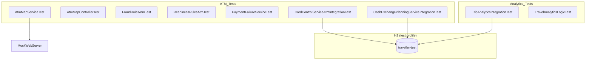

# Traveller 项目单元测试文档（ATM & Analytics）

## 1. 概述

本文档记录 `traveller` 项目中 **ATM Finder** 与 **Analytics** 两个图标功能的单元测试与集成测试。

| 功能 | 实现位置 | 测试策略 |
|------|----------|----------|
| **ATM Finder** | 后端 `AtmMapController` / `AtmMapService`；取款限额、欺诈规则、现金规划等 | 单元测试 + H2 集成测试 |
| **Analytics** | 纯前端 `showTravelAnalytics()`（`app.js`） | 镜像前端计算逻辑的单元测试 + Trip API 的 H2 集成测试 |

### 测试环境

- **数据库**：H2 内存数据库（`application-test.yml`）
- **Profile**：`test`
- **JDK**：Java 17（`pom.xml` 中 `<java.version>17</java.version>`）
- **本地 JDK 路径**：`D:\dev\jdk\jdk-17.0.13+11`（Temurin 17.0.13）
- **运行命令**：

```bash
cd traveller
# Windows PowerShell 示例
$env:JAVA_HOME = "D:\dev\jdk\jdk-17.0.13+11"
mvn test
```

仅运行 ATM / Analytics 相关测试：

```bash
mvn test -Dtest="AtmMap*,FraudRulesAtm*,ReadinessRulesAtm*,PaymentFailureServiceTest,FraudMonitoringServiceAtm*,MockFraudDetectionClientAtm*,CardControlServiceAtm*,CashExchangePlanningService*,TripAnalytics*,TravelAnalytics*"
```

### H2 配置（`application-test.yml`）

```yaml
spring:
  datasource:
    url: jdbc:h2:mem:traveller-test;MODE=MySQL;DB_CLOSE_DELAY=-1
    username: sa
    password:
  jpa:
    hibernate:
      ddl-auto: create-drop
integration:
  fx:
    enabled: false
```

---

## 2. 测试范围

### 2.1 ATM 功能覆盖

| 模块 | 被测类 | 测试类 |
|------|--------|--------|
| ATM 地图地理编码 | `AtmMapService.geocode()` | `AtmMapServiceTest` |
| ATM 附近搜索 | `AtmMapService.nearby()` | `AtmMapServiceTest` |
| ATM REST API | `AtmMapController` | `AtmMapControllerTest` |
| 异常 ATM 取款欺诈规则 | `UnusualAtmWithdrawalRule` | `FraudRulesAtmTest` |
| 出行准备：取款限额 | `WithdrawalLimitRule` | `ReadinessRulesAtmTest` |
| ATM 限额失败解释 | `PaymentFailureService` | `PaymentFailureServiceTest` |
| 外部欺诈 Mock（ATM 信号） | `MockFraudDetectionClient` | `MockFraudDetectionClientAtmTest` |
| 客户画像（首次 ATM） | `FraudMonitoringService.profileScore()` | `FraudMonitoringServiceAtmTest` |
| 修改取款限额 | `CardControlService.withdrawalLimit()` | `CardControlServiceAtmIntegrationTest` |
| 现金兑换规划（ATM 可用性建议） | `CashExchangePlanningService` | `CashExchangePlanningServiceIntegrationTest` |

### 2.2 Analytics 功能覆盖

Analytics 无独立后端服务，依赖 `GET /api/travel/trips` 返回的行程数据。

| 模块 | 说明 | 测试类 |
|------|------|--------|
| 行程数据源 | `TripService.list()` 在 H2 上返回已完成行程 | `TripAnalyticsIntegrationTest` |
| 前端指标计算 | 镜像 `showTravelAnalytics()` 中的筛选与统计逻辑 | `TravelAnalyticsLogicTest` |

---

## 3. 测试用例明细

### 3.1 AtmMapServiceTest（9 个用例）

| # | 测试方法 | 场景 | 预期结果 |
|---|----------|------|----------|
| 1 | `geocodeReturnsLocationFromNominatim` | 有效地点查询 | 返回经纬度与标签 |
| 2 | `geocodeCachesRepeatedQueries` | 重复查询同一地点 | 仅调用一次外部 API |
| 3 | `geocodeRejectsShortQuery` | 查询长度 < 2 | 抛出 `IllegalArgumentException` |
| 4 | `geocodeThrowsWhenLocationNotFound` | Nominatim 返回空数组 | 抛出 `ResourceNotFoundException` |
| 5 | `nearbyClampsRadiusToValidRange` | 请求半径 100m | 自动钳制为 500m 并返回结果 |
| 6 | `nearbyReturnsAtmsFromOverpass` | Overpass 返回 ATM 节点 | 按距离排序，provider 为 OpenStreetMap |
| 7 | `nearbyFallsBackToNominatimWhenOverpassFails` | Overpass 500 错误 | 降级到 Nominatim 并返回 ATM |
| 8 | `nearbyReturnsEmptyWhenAllProvidersFail` | 两个服务均不可用 | 返回空列表，provider 含 unavailable |
| 9 | `nearbyCachesResultsForSameCoordinates` | 相同坐标重复搜索 | 仅调用一次 Overpass |

**核心测试代码示例：**

```java
@Test
void nearbyReturnsAtmsFromOverpass() throws Exception {
    String overpassBody = """
            {"elements":[{"type":"node","id":42,"lat":48.857,"lon":2.353,
            "tags":{"brand":"HSBC","operator":"HSBC","addr:street":"Rue Test","addr:city":"Paris"}}]}
            """;
    placesServer.enqueue(new MockResponse().setBody(overpassBody)
            .addHeader("Content-Type", "application/json"));

    AtmSearchResponse result = service.nearby(48.8566, 2.3522, 2000);

    assertThat(result.atms()).hasSize(1);
    assertThat(result.atms().get(0).name()).isEqualTo("HSBC");
}
```

---

### 3.2 AtmMapControllerTest（3 个用例）

| # | 测试方法 | 场景 | 预期结果 |
|---|----------|------|----------|
| 1 | `geocodeEndpointReturnsLocation` | GET `/api/travel/maps/geocode?q=Paris` | 200，返回 latitude/longitude |
| 2 | `atmsEndpointReturnsNearbyResults` | GET `/api/travel/maps/atms` | 200，返回 ATM 列表 |
| 3 | `atmsEndpointUsesDefaultRadius` | 未传 radius 参数 | 默认使用 2000m |

---

### 3.3 FraudRulesAtmTest（9 个用例）

| # | 测试方法 | 场景 | 预期结果 |
|---|----------|------|----------|
| 1 | `doesNotTriggerForNonAtmTransaction` | 普通 PURCHASE 交易 | 不触发 |
| 2 | `doesNotTriggerForFirstAtmWithdrawal` | 首次 ATM 取款 | 不触发，0 分 |
| 3 | `doesNotTriggerForSecondAtmWithinTwoHours` | 2 小时内第 2 次取款 | 不触发 |
| 4 | `triggersWhenThreeAtmWithdrawalsWithinTwoHours` | 2 小时内第 3 次取款 | 触发，45 分，规则码 `UNUSUAL_ATM_WITHDRAWAL` |
| 5 | `doesNotCountAtmWithdrawalsOlderThanTwoHours` | 超过 2 小时的取款不计入 | 不触发 |
| 6-8 | `respectsConfiguredRiskPoints(45/60/75)` | 参数化风险分值 | 返回配置的分值 |

---

### 3.4 ReadinessRulesAtmTest（9 个用例）

| # | 测试方法 | 场景 | 预期结果 |
|---|----------|------|----------|
| 1 | `passesWhenWithdrawalLimitIsAtLeast100` | 限额 = $100 | 通过 `WITHDRAWAL_LIMIT` |
| 2 | `passesWhenWithdrawalLimitExceeds100` | 限额 = $1000 | 通过 |
| 3 | `failsWhenWithdrawalLimitBelow100` | 限额 = $50 | 失败 `WITHDRAWAL_LIMIT_LOW`，-5 分 |
| 4-6 | `failsForLimitsBelowThreshold(0/50/99.99)` | 参数化低于阈值 | 失败 |
| 7-9 | `passesForLimitsAtOrAboveThreshold(100/500/5000)` | 参数化达到阈值 | 通过 |

---

### 3.5 PaymentFailureServiceTest（4 个用例，含 2 个 ATM）

| # | 测试方法 | 场景 | 预期结果 |
|---|----------|------|----------|
| 1 | `explainsPaymentLimitWithoutExposingTechnicalDetails` | `LIMIT_EXCEEDED` | 标题 "Payment limit reached" |
| 2 | `explainsAtmLimitExceeded` | `ATM_LIMIT_EXCEEDED` | 标题 "ATM limit reached"，动作 `INCREASE_LIMIT` |
| 3 | `handlesUnknownFailure` | 未知错误码 | 动作 `CONTACT_BANK` |
| 4 | `handlesNullFailureCode` | null 错误码 | 标题 "Payment declined" |

---

### 3.6 MockFraudDetectionClientAtmTest（2 个用例）

| # | 测试方法 | 场景 | 预期结果 |
|---|----------|------|----------|
| 1 | `addsAtmSignalForAtmWithdrawal` | ATM_WITHDRAWAL 交易 | 信号含 "ATM"，分数 ≥ 10 |
| 2 | `doesNotAddAtmSignalForPurchase` | PURCHASE 交易 | 信号不含 "ATM" |

---

### 3.7 FraudMonitoringServiceAtmTest（2 个用例）

| # | 测试方法 | 场景 | 预期结果 |
|---|----------|------|----------|
| 1 | `firstAtmWithdrawalAddsProfileAnomalyPoints` | 历史中无 prior ATM | `bankProfileScore` = 15 |
| 2 | `repeatedAtmWithdrawalsTriggerUnusualAtmRule` | 2 小时内 3 次取款 | `internalScore` = 45，含 `UNUSUAL_ATM_WITHDRAWAL` |

---

### 3.8 CardControlServiceAtmIntegrationTest（2 个用例，H2）

| # | 测试方法 | 场景 | 预期结果 |
|---|----------|------|----------|
| 1 | `updatesWithdrawalLimit` | PUT 取款限额 $1000 | 数据库持久化 $1000 |
| 2 | `auditLogRecordedForWithdrawalLimitChange` | 修改限额 | 审计日志含 `CARD_LIMIT_CHANGED` |

---

### 3.9 CashExchangePlanningServiceIntegrationTest（3 个用例，H2）

| # | 测试方法 | 场景 | 预期结果 |
|---|----------|------|----------|
| 1 | `savesCashExchangePlanWithAtmAvailabilityForJapan` | 日本行程现金规划 | `atmAvailability` 含 Japan Post ATMs |
| 2 | `providesGenericAtmAdviceForUnknownDestination` | 巴西（无预设建议） | 返回通用 bank-owned ATM 建议 |
| 3 | `recordsAuditLogForCashExchangePlan` | 保存现金计划 | 审计日志 `CASH_EXCHANGE_PLAN_RECORDED` |

---

### 3.10 TripAnalyticsIntegrationTest（4 个用例，H2）

| # | 测试方法 | 场景 | 预期结果 |
|---|----------|------|----------|
| 1 | `listsAllTripsForCustomer` | 4 条行程（含不同状态） | 返回 4 条 |
| 2 | `completedTripsFilterMatchesAnalyticsLogic` | 筛选 COMPLETED | 仅 2 条（France、Japan） |
| 3 | `uniqueCountriesForAnalyticsMetrics` | 统计国家数 | 2 个不同国家 |
| 4 | `excludesNonCompletedTripsFromAnalytics` | ACTIVE/PLANNED 行程 | 不出现在 Analytics 数据中 |

---

### 3.11 TravelAnalyticsLogicTest（11 个用例）

镜像 `app.js` 中 `showTravelAnalytics()` 的计算逻辑：

| # | 测试方法 | 场景 | 预期结果 |
|---|----------|------|----------|
| 1 | `filtersOnlyCompletedTrips` | 混合状态行程 | 仅 COMPLETED |
| 2 | `calculatesWorldPercent` | 2 个国家 | worldPercent = 1.0% |
| 3 | `countsUniqueCountries` | 法国+日本各一次 | uniqueCountries = 2 |
| 4 | `sortsHistoryByEndDateDescending` | 按结束日期排序 | Paris 在前，Tokyo 在后 |
| 5 | `mapsTripsWithKnownCoordinates` | 有坐标的城市 | 2 条可标点 |
| 6 | `excludesTripsWithoutCoordinates` | 巴西 Rio（无坐标） | 0 条可标点 |
| 7-10 | `worldPercentFormula(0/1/2/10)` | 参数化世界百分比 | 0.0 / 0.5 / 1.0 / 5.1 |
| 11 | `emptyHistoryShowsZeroMetrics` | 无已完成行程 | 所有指标为 0 |

**前端逻辑镜像代码：**

```java
static List<TripStub> completedHistory(List<TripStub> trips) {
    return trips.stream().filter(t -> "COMPLETED".equals(t.status())).toList();
}

static double worldPercent(int countryCount) {
    return Math.round(countryCount / 195.0 * 1000.0) / 10.0;
}
```

---

## 4. 测试文件清单

```
src/test/java/com/travelassistant/
├── TestFixtures.java                              # 共享测试数据工厂
├── controller/
│   └── AtmMapControllerTest.java                  # ATM REST API
├── service/
│   ├── AtmMapServiceTest.java                     # ATM 地图服务（MockWebServer）
│   ├── PaymentFailureServiceTest.java             # 含 ATM_LIMIT_EXCEEDED
│   ├── FraudMonitoringServiceAtmTest.java         # 首次 ATM 画像评分
│   ├── CardControlServiceAtmIntegrationTest.java  # 取款限额（H2）
│   └── CashExchangePlanningServiceIntegrationTest.java  # 现金规划（H2）
├── rule/fraud/
│   ├── FraudRulesAtmTest.java                     # UNUSUAL_ATM_WITHDRAWAL 规则
│   └── FraudMonitoringServiceAtmTest.java         # 首次 ATM 画像评分
├── rule/readiness/
│   └── ReadinessRulesAtmTest.java                 # WITHDRAWAL_LIMIT 规则
├── integration/
│   └── MockFraudDetectionClientAtmTest.java       # 外部欺诈 ATM 信号
└── analytics/
    ├── TripAnalyticsIntegrationTest.java          # Analytics 数据源（H2）
    └── TravelAnalyticsLogicTest.java              # Analytics 前端逻辑镜像
```

---

## 5. 测试统计

| 类别 | 测试类数 | 用例数 |
|------|----------|--------|
| ATM 地图服务 | 2 | 12 |
| ATM 欺诈与风控 | 3 | 12 |
| ATM 限额与准备 | 3 | 15 |
| ATM 现金规划（H2） | 1 | 3 |
| Analytics 数据源（H2） | 1 | 4 |
| Analytics 前端逻辑 | 1 | 11 |
| **ATM/Analytics 合计** | **11** | **57** |
| 其他（上下文加载、汇率） | 2 | 2 |
| **全量测试合计** | **13** | **59** |

---

## 6. 测试结果

### 6.1 本地执行摘要

| 项目 | 值 |
|------|-----|
| 执行时间 | 2026-07-28 16:36:21 (UTC+8) |
| JDK | OpenJDK Temurin **17.0.13+11** |
| 数据库 | H2 内存库 `jdbc:h2:mem:traveller-test` |
| Maven 总耗时 | 19.065 s |
| **Tests run** | **59** |
| **Failures** | **0** |
| **Errors** | **0** |
| **Skipped** | **0** |
| **构建结果** | **BUILD SUCCESS** |

### 6.2 ATM / Analytics 测试类结果

| 测试类 | 用例数 | 耗时 | 结果 |
|--------|--------|------|------|
| `TravelAnalyticsLogicTest` | 11 | 0.143 s | ✅ PASS |
| `TripAnalyticsIntegrationTest` | 4 | 8.231 s | ✅ PASS |
| `AtmMapControllerTest` | 3 | 0.274 s | ✅ PASS |
| `MockFraudDetectionClientAtmTest` | 2 | 0.007 s | ✅ PASS |
| `FraudMonitoringServiceAtmTest` | 2 | 0.116 s | ✅ PASS |
| `FraudRulesAtmTest` | 8 | 0.023 s | ✅ PASS |
| `ReadinessRulesAtmTest` | 9 | 0.020 s | ✅ PASS |
| `AtmMapServiceTest` | 9 | 0.638 s | ✅ PASS |
| `CardControlServiceAtmIntegrationTest` | 2 | 0.048 s | ✅ PASS |
| `CashExchangePlanningServiceIntegrationTest` | 3 | 0.048 s | ✅ PASS |
| `PaymentFailureServiceTest` | 4 | 0.005 s | ✅ PASS |
| **小计** | **57** | — | **全部通过** |

### 6.3 同次运行的其他测试

| 测试类 | 用例数 | 耗时 | 结果 |
|--------|--------|------|------|
| `ExchangeRateServiceTest` | 1 | 0.001 s | ✅ PASS |
| `TravelAssistantApplicationTests` | 1 | 1.788 s | ✅ PASS |

### 6.4 各测试方法明细

#### TravelAnalyticsLogicTest（11/11 PASS）

| 测试方法 | 结果 |
|----------|------|
| `filtersOnlyCompletedTrips` | ✅ |
| `calculatesWorldPercent` | ✅ |
| `countsUniqueCountries` | ✅ |
| `sortsHistoryByEndDateDescending` | ✅ |
| `mapsTripsWithKnownCoordinates` | ✅ |
| `excludesTripsWithoutCoordinates` | ✅ |
| `worldPercentFormula(0, 0.0)` | ✅ |
| `worldPercentFormula(1, 0.5)` | ✅ |
| `worldPercentFormula(2, 1.0)` | ✅ |
| `worldPercentFormula(10, 5.1)` | ✅ |
| `emptyHistoryShowsZeroMetrics` | ✅ |

#### TripAnalyticsIntegrationTest（4/4 PASS，H2）

| 测试方法 | 结果 |
|----------|------|
| `listsAllTripsForCustomer` | ✅ |
| `completedTripsFilterMatchesAnalyticsLogic` | ✅ |
| `uniqueCountriesForAnalyticsMetrics` | ✅ |
| `excludesNonCompletedTripsFromAnalytics` | ✅ |

#### AtmMapControllerTest（3/3 PASS）

| 测试方法 | 结果 |
|----------|------|
| `geocodeEndpointReturnsLocation` | ✅ |
| `atmsEndpointReturnsNearbyResults` | ✅ |
| `atmsEndpointUsesDefaultRadius` | ✅ |

#### AtmMapServiceTest（9/9 PASS）

| 测试方法 | 结果 |
|----------|------|
| `geocodeReturnsLocationFromNominatim` | ✅ |
| `geocodeCachesRepeatedQueries` | ✅ |
| `geocodeRejectsShortQuery` | ✅ |
| `geocodeThrowsWhenLocationNotFound` | ✅ |
| `nearbyClampsRadiusToValidRange` | ✅ |
| `nearbyReturnsAtmsFromOverpass` | ✅ |
| `nearbyFallsBackToNominatimWhenOverpassFails` | ✅ |
| `nearbyReturnsEmptyWhenAllProvidersFail` | ✅ |
| `nearbyCachesResultsForSameCoordinates` | ✅ |

#### FraudRulesAtmTest（8/8 PASS）

| 测试方法 | 结果 |
|----------|------|
| `doesNotTriggerForNonAtmTransaction` | ✅ |
| `doesNotTriggerForFirstAtmWithdrawal` | ✅ |
| `doesNotTriggerForSecondAtmWithinTwoHours` | ✅ |
| `triggersWhenThreeAtmWithdrawalsWithinTwoHours` | ✅ |
| `doesNotCountAtmWithdrawalsOlderThanTwoHours` | ✅ |
| `respectsConfiguredRiskPoints(45)` | ✅ |
| `respectsConfiguredRiskPoints(60)` | ✅ |
| `respectsConfiguredRiskPoints(75)` | ✅ |

#### ReadinessRulesAtmTest（9/9 PASS）

| 测试方法 | 结果 |
|----------|------|
| `passesWhenWithdrawalLimitIsAtLeast100` | ✅ |
| `passesWhenWithdrawalLimitExceeds100` | ✅ |
| `failsWhenWithdrawalLimitBelow100` | ✅ |
| `failsForLimitsBelowThreshold(0)` | ✅ |
| `failsForLimitsBelowThreshold(50)` | ✅ |
| `failsForLimitsBelowThreshold(99.99)` | ✅ |
| `passesForLimitsAtOrAboveThreshold(100)` | ✅ |
| `passesForLimitsAtOrAboveThreshold(500)` | ✅ |
| `passesForLimitsAtOrAboveThreshold(5000)` | ✅ |

#### PaymentFailureServiceTest（4/4 PASS）

| 测试方法 | 结果 |
|----------|------|
| `explainsPaymentLimitWithoutExposingTechnicalDetails` | ✅ |
| `explainsAtmLimitExceeded` | ✅ |
| `handlesUnknownFailure` | ✅ |
| `handlesNullFailureCode` | ✅ |

#### FraudMonitoringServiceAtmTest（2/2 PASS）

| 测试方法 | 结果 |
|----------|------|
| `firstAtmWithdrawalAddsProfileAnomalyPoints` | ✅ |
| `repeatedAtmWithdrawalsTriggerUnusualAtmRule` | ✅ |

#### MockFraudDetectionClientAtmTest（2/2 PASS）

| 测试方法 | 结果 |
|----------|------|
| `addsAtmSignalForAtmWithdrawal` | ✅ |
| `doesNotAddAtmSignalForPurchase` | ✅ |

#### CardControlServiceAtmIntegrationTest（2/2 PASS，H2）

| 测试方法 | 结果 |
|----------|------|
| `updatesWithdrawalLimit` | ✅ |
| `auditLogRecordedForWithdrawalLimitChange` | ✅ |

#### CashExchangePlanningServiceIntegrationTest（3/3 PASS，H2）

| 测试方法 | 结果 |
|----------|------|
| `savesCashExchangePlanWithAtmAvailabilityForJapan` | ✅ |
| `providesGenericAtmAdviceForUnknownDestination` | ✅ |
| `recordsAuditLogForCashExchangePlan` | ✅ |

### 6.5 运行命令

```bash
cd traveller
$env:JAVA_HOME = "D:\dev\jdk\jdk-17.0.13+11"
mvn test
# 报告路径：target/surefire-reports/
```

仅运行 ATM / Analytics 相关测试：

```bash
mvn test -Dtest="AtmMap*,FraudRulesAtm*,ReadinessRulesAtm*,FraudMonitoringServiceAtm*,PaymentFailureServiceTest,MockFraudDetectionClientAtm*,CardControlServiceAtm*,CashExchangePlanningService*,TripAnalytics*,TravelAnalytics*"
```

### 6.6 项目变更说明

1. **`pom.xml`**：`<java.version>` 从 21 改为 **17**
2. **测试代码**：将 Java 21 的 `List.getFirst()` / `getLast()` 替换为 Java 17 兼容写法
3. **新增依赖**：`mockwebserver 4.12.0`（test scope）

```xml
<dependency>
    <groupId>com.squareup.okhttp3</groupId>
    <artifactId>mockwebserver</artifactId>
    <version>4.12.0</version>
    <scope>test</scope>
</dependency>
```

---

## 7. 架构关系



---

## 8. 未覆盖说明

| 项目 | 原因 |
|------|------|
| Leaflet 地图渲染（`renderAtmMap` / `renderTravelWorldMap`） | 纯浏览器端 UI，需 E2E 测试（如 Playwright） |
| 真实 OpenStreetMap API 调用 | 单元测试使用 MockWebServer 隔离外部依赖 |
| `increaseAtmLimit()` 前端 step-up 认证流程 | 涉及完整认证链路，建议单独做 API 集成测试 |

---

*文档最后更新：2026-07-28（Java 17 本地实测通过）*
