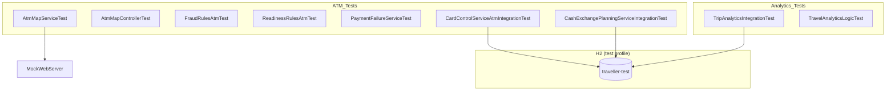

# Traveller Project Unit Test Documentation (ATM & Analytics)

## 1. Overview

This document records the unit and integration tests for the **ATM Finder** and **Analytics** icon features in the `traveller` project.

| Feature | Implementation | Test Strategy |
|---------|----------------|---------------|
| **ATM Finder** | Backend `AtmMapController` / `AtmMapService`; withdrawal limits, fraud rules, cash planning, etc. | Unit tests + H2 integration tests |
| **Analytics** | Frontend-only `showTravelAnalytics()` (`app.js`) | Unit tests mirroring frontend calculation logic + H2 integration tests for Trip API |

### Test Environment

- **Database**: H2 in-memory database (`application-test.yml`)
- **Profile**: `test`
- **JDK**: Java 17 (`<java.version>17</java.version>` in `pom.xml`)
- **Local JDK path**: `D:\dev\jdk\jdk-17.0.13+11` (Temurin 17.0.13)
- **Run command**:

```bash
cd traveller
# Windows PowerShell example
$env:JAVA_HOME = "D:\dev\jdk\jdk-17.0.13+11"
mvn test
```

Run only ATM / Analytics related tests:

```bash
mvn test -Dtest="AtmMap*,FraudRulesAtm*,ReadinessRulesAtm*,PaymentFailureServiceTest,FraudMonitoringServiceAtm*,MockFraudDetectionClientAtm*,CardControlServiceAtm*,CashExchangePlanningService*,TripAnalytics*,TravelAnalytics*"
```

### H2 Configuration (`application-test.yml`)

```yaml
spring:
  datasource:
    url: jdbc:h2:mem:traveller-test;MODE=MySQL;DB_CLOSE_DELAY=-1
    username: sa
    password:
  jpa:
    hibernate:
      ddl-auto: create-drop
integration:
  fx:
    enabled: false
```

---

## 2. Test Scope

### 2.1 ATM Feature Coverage

| Module | Class Under Test | Test Class |
|--------|------------------|------------|
| ATM map geocoding | `AtmMapService.geocode()` | `AtmMapServiceTest` |
| Nearby ATM search | `AtmMapService.nearby()` | `AtmMapServiceTest` |
| ATM REST API | `AtmMapController` | `AtmMapControllerTest` |
| Unusual ATM withdrawal fraud rule | `UnusualAtmWithdrawalRule` | `FraudRulesAtmTest` |
| Travel readiness: withdrawal limit | `WithdrawalLimitRule` | `ReadinessRulesAtmTest` |
| ATM limit failure explanation | `PaymentFailureService` | `PaymentFailureServiceTest` |
| External fraud mock (ATM signal) | `MockFraudDetectionClient` | `MockFraudDetectionClientAtmTest` |
| Customer profile (first ATM) | `FraudMonitoringService.profileScore()` | `FraudMonitoringServiceAtmTest` |
| Update withdrawal limit | `CardControlService.withdrawalLimit()` | `CardControlServiceAtmIntegrationTest` |
| Cash exchange planning (ATM availability advice) | `CashExchangePlanningService` | `CashExchangePlanningServiceIntegrationTest` |

### 2.2 Analytics Feature Coverage

Analytics has no dedicated backend service; it depends on trip data returned by `GET /api/travel/trips`.

| Module | Description | Test Class |
|--------|-------------|------------|
| Trip data source | `TripService.list()` returns completed trips on H2 | `TripAnalyticsIntegrationTest` |
| Frontend metric calculation | Mirrors filtering and statistics logic in `showTravelAnalytics()` | `TravelAnalyticsLogicTest` |

---

## 3. Test Case Details

### 3.1 AtmMapServiceTest (9 cases)

| # | Test Method | Scenario | Expected Result |
|---|-------------|----------|-----------------|
| 1 | `geocodeReturnsLocationFromNominatim` | Valid location query | Returns latitude, longitude, and label |
| 2 | `geocodeCachesRepeatedQueries` | Repeated query for same location | External API called only once |
| 3 | `geocodeRejectsShortQuery` | Query length < 2 | Throws `IllegalArgumentException` |
| 4 | `geocodeThrowsWhenLocationNotFound` | Nominatim returns empty array | Throws `ResourceNotFoundException` |
| 5 | `nearbyClampsRadiusToValidRange` | Requested radius 100m | Clamped to 500m and returns results |
| 6 | `nearbyReturnsAtmsFromOverpass` | Overpass returns ATM nodes | Sorted by distance; provider is OpenStreetMap |
| 7 | `nearbyFallsBackToNominatimWhenOverpassFails` | Overpass 500 error | Falls back to Nominatim and returns ATMs |
| 8 | `nearbyReturnsEmptyWhenAllProvidersFail` | Both services unavailable | Returns empty list; provider contains unavailable |
| 9 | `nearbyCachesResultsForSameCoordinates` | Repeated search at same coordinates | Overpass called only once |

**Core test code example:**

```java
@Test
void nearbyReturnsAtmsFromOverpass() throws Exception {
    String overpassBody = """
            {"elements":[{"type":"node","id":42,"lat":48.857,"lon":2.353,
            "tags":{"brand":"HSBC","operator":"HSBC","addr:street":"Rue Test","addr:city":"Paris"}}]}
            """;
    placesServer.enqueue(new MockResponse().setBody(overpassBody)
            .addHeader("Content-Type", "application/json"));

    AtmSearchResponse result = service.nearby(48.8566, 2.3522, 2000);

    assertThat(result.atms()).hasSize(1);
    assertThat(result.atms().get(0).name()).isEqualTo("HSBC");
}
```

---

### 3.2 AtmMapControllerTest (3 cases)

| # | Test Method | Scenario | Expected Result |
|---|-------------|----------|-----------------|
| 1 | `geocodeEndpointReturnsLocation` | GET `/api/travel/maps/geocode?q=Paris` | 200; returns latitude/longitude |
| 2 | `atmsEndpointReturnsNearbyResults` | GET `/api/travel/maps/atms` | 200; returns ATM list |
| 3 | `atmsEndpointUsesDefaultRadius` | No radius parameter | Defaults to 2000m |

---

### 3.3 FraudRulesAtmTest (9 cases)

| # | Test Method | Scenario | Expected Result |
|---|-------------|----------|-----------------|
| 1 | `doesNotTriggerForNonAtmTransaction` | Regular PURCHASE transaction | Not triggered |
| 2 | `doesNotTriggerForFirstAtmWithdrawal` | First ATM withdrawal | Not triggered; 0 points |
| 3 | `doesNotTriggerForSecondAtmWithinTwoHours` | 2nd withdrawal within 2 hours | Not triggered |
| 4 | `triggersWhenThreeAtmWithdrawalsWithinTwoHours` | 3rd withdrawal within 2 hours | Triggered; 45 points; rule code `UNUSUAL_ATM_WITHDRAWAL` |
| 5 | `doesNotCountAtmWithdrawalsOlderThanTwoHours` | Withdrawals older than 2 hours not counted | Not triggered |
| 6-8 | `respectsConfiguredRiskPoints(45/60/75)` | Parameterized risk scores | Returns configured score |

---

### 3.4 ReadinessRulesAtmTest (9 cases)

| # | Test Method | Scenario | Expected Result |
|---|-------------|----------|-----------------|
| 1 | `passesWhenWithdrawalLimitIsAtLeast100` | Limit = $100 | Passes `WITHDRAWAL_LIMIT` |
| 2 | `passesWhenWithdrawalLimitExceeds100` | Limit = $1000 | Passes |
| 3 | `failsWhenWithdrawalLimitBelow100` | Limit = $50 | Fails `WITHDRAWAL_LIMIT_LOW`; -5 points |
| 4-6 | `failsForLimitsBelowThreshold(0/50/99.99)` | Parameterized below threshold | Fails |
| 7-9 | `passesForLimitsAtOrAboveThreshold(100/500/5000)` | Parameterized at/above threshold | Passes |

---

### 3.5 PaymentFailureServiceTest (4 cases, including 2 ATM)

| # | Test Method | Scenario | Expected Result |
|---|-------------|----------|-----------------|
| 1 | `explainsPaymentLimitWithoutExposingTechnicalDetails` | `LIMIT_EXCEEDED` | Title "Payment limit reached" |
| 2 | `explainsAtmLimitExceeded` | `ATM_LIMIT_EXCEEDED` | Title "ATM limit reached"; action `INCREASE_LIMIT` |
| 3 | `handlesUnknownFailure` | Unknown error code | Action `CONTACT_BANK` |
| 4 | `handlesNullFailureCode` | null error code | Title "Payment declined" |

---

### 3.6 MockFraudDetectionClientAtmTest (2 cases)

| # | Test Method | Scenario | Expected Result |
|---|-------------|----------|-----------------|
| 1 | `addsAtmSignalForAtmWithdrawal` | ATM_WITHDRAWAL transaction | Signal contains "ATM"; score ≥ 10 |
| 2 | `doesNotAddAtmSignalForPurchase` | PURCHASE transaction | Signal does not contain "ATM" |

---

### 3.7 FraudMonitoringServiceAtmTest (2 cases)

| # | Test Method | Scenario | Expected Result |
|---|-------------|----------|-----------------|
| 1 | `firstAtmWithdrawalAddsProfileAnomalyPoints` | No prior ATM in history | `bankProfileScore` = 15 |
| 2 | `repeatedAtmWithdrawalsTriggerUnusualAtmRule` | 3 withdrawals within 2 hours | `internalScore` = 45; includes `UNUSUAL_ATM_WITHDRAWAL` |

---

### 3.8 CardControlServiceAtmIntegrationTest (2 cases, H2)

| # | Test Method | Scenario | Expected Result |
|---|-------------|----------|-----------------|
| 1 | `updatesWithdrawalLimit` | PUT withdrawal limit $1000 | Persisted as $1000 in database |
| 2 | `auditLogRecordedForWithdrawalLimitChange` | Limit change | Audit log contains `CARD_LIMIT_CHANGED` |

---

### 3.9 CashExchangePlanningServiceIntegrationTest (3 cases, H2)

| # | Test Method | Scenario | Expected Result |
|---|-------------|----------|-----------------|
| 1 | `savesCashExchangePlanWithAtmAvailabilityForJapan` | Japan trip cash plan | `atmAvailability` contains Japan Post ATMs |
| 2 | `providesGenericAtmAdviceForUnknownDestination` | Brazil (no preset advice) | Returns generic bank-owned ATM advice |
| 3 | `recordsAuditLogForCashExchangePlan` | Save cash plan | Audit log `CASH_EXCHANGE_PLAN_RECORDED` |

---

### 3.10 TripAnalyticsIntegrationTest (4 cases, H2)

| # | Test Method | Scenario | Expected Result |
|---|-------------|----------|-----------------|
| 1 | `listsAllTripsForCustomer` | 4 trips (mixed statuses) | Returns 4 trips |
| 2 | `completedTripsFilterMatchesAnalyticsLogic` | Filter COMPLETED | Only 2 trips (France, Japan) |
| 3 | `uniqueCountriesForAnalyticsMetrics` | Count countries | 2 distinct countries |
| 4 | `excludesNonCompletedTripsFromAnalytics` | ACTIVE/PLANNED trips | Excluded from Analytics data |

---

### 3.11 TravelAnalyticsLogicTest (11 cases)

Mirrors the calculation logic in `showTravelAnalytics()` from `app.js`:

| # | Test Method | Scenario | Expected Result |
|---|-------------|----------|-----------------|
| 1 | `filtersOnlyCompletedTrips` | Mixed-status trips | Only COMPLETED |
| 2 | `calculatesWorldPercent` | 2 countries | worldPercent = 1.0% |
| 3 | `countsUniqueCountries` | France + Japan once each | uniqueCountries = 2 |
| 4 | `sortsHistoryByEndDateDescending` | Sort by end date | Paris first, Tokyo last |
| 5 | `mapsTripsWithKnownCoordinates` | Cities with coordinates | 2 mappable trips |
| 6 | `excludesTripsWithoutCoordinates` | Rio, Brazil (no coordinates) | 0 mappable trips |
| 7-10 | `worldPercentFormula(0/1/2/10)` | Parameterized world percentage | 0.0 / 0.5 / 1.0 / 5.1 |
| 11 | `emptyHistoryShowsZeroMetrics` | No completed trips | All metrics are 0 |

**Frontend logic mirror code:**

```java
static List<TripStub> completedHistory(List<TripStub> trips) {
    return trips.stream().filter(t -> "COMPLETED".equals(t.status())).toList();
}

static double worldPercent(int countryCount) {
    return Math.round(countryCount / 195.0 * 1000.0) / 10.0;
}
```

---

## 4. Test File Inventory

```
src/test/java/com/travelassistant/
├── TestFixtures.java                              # Shared test data factory
├── controller/
│   └── AtmMapControllerTest.java                  # ATM REST API
├── service/
│   ├── AtmMapServiceTest.java                     # ATM map service (MockWebServer)
│   ├── PaymentFailureServiceTest.java             # Includes ATM_LIMIT_EXCEEDED
│   ├── FraudMonitoringServiceAtmTest.java         # First ATM profile scoring
│   ├── CardControlServiceAtmIntegrationTest.java  # Withdrawal limit (H2)
│   └── CashExchangePlanningServiceIntegrationTest.java  # Cash planning (H2)
├── rule/fraud/
│   ├── FraudRulesAtmTest.java                     # UNUSUAL_ATM_WITHDRAWAL rule
│   └── FraudMonitoringServiceAtmTest.java         # First ATM profile scoring
├── rule/readiness/
│   └── ReadinessRulesAtmTest.java                 # WITHDRAWAL_LIMIT rule
├── integration/
│   └── MockFraudDetectionClientAtmTest.java       # External fraud ATM signal
└── analytics/
    ├── TripAnalyticsIntegrationTest.java          # Analytics data source (H2)
    └── TravelAnalyticsLogicTest.java              # Analytics frontend logic mirror
```

---

## 5. Test Statistics

| Category | Test Classes | Test Cases |
|----------|--------------|------------|
| ATM map service | 2 | 12 |
| ATM fraud & risk | 3 | 12 |
| ATM limits & readiness | 3 | 15 |
| ATM cash planning (H2) | 1 | 3 |
| Analytics data source (H2) | 1 | 4 |
| Analytics frontend logic | 1 | 11 |
| **ATM/Analytics subtotal** | **11** | **57** |
| Other (context load, exchange rate) | 2 | 2 |
| **Full test suite total** | **13** | **59** |

---

## 6. Test Results

### 6.1 Local Execution Summary

| Item | Value |
|------|-------|
| Execution time | 2026-07-28 16:36:21 (UTC+8) |
| JDK | OpenJDK Temurin **17.0.13+11** |
| Database | H2 in-memory `jdbc:h2:mem:traveller-test` |
| Maven total time | 19.065 s |
| **Tests run** | **59** |
| **Failures** | **0** |
| **Errors** | **0** |
| **Skipped** | **0** |
| **Build result** | **BUILD SUCCESS** |

### 6.2 ATM / Analytics Test Class Results

| Test Class | Cases | Time | Result |
|------------|-------|------|--------|
| `TravelAnalyticsLogicTest` | 11 | 0.143 s | ✅ PASS |
| `TripAnalyticsIntegrationTest` | 4 | 8.231 s | ✅ PASS |
| `AtmMapControllerTest` | 3 | 0.274 s | ✅ PASS |
| `MockFraudDetectionClientAtmTest` | 2 | 0.007 s | ✅ PASS |
| `FraudMonitoringServiceAtmTest` | 2 | 0.116 s | ✅ PASS |
| `FraudRulesAtmTest` | 8 | 0.023 s | ✅ PASS |
| `ReadinessRulesAtmTest` | 9 | 0.020 s | ✅ PASS |
| `AtmMapServiceTest` | 9 | 0.638 s | ✅ PASS |
| `CardControlServiceAtmIntegrationTest` | 2 | 0.048 s | ✅ PASS |
| `CashExchangePlanningServiceIntegrationTest` | 3 | 0.048 s | ✅ PASS |
| `PaymentFailureServiceTest` | 4 | 0.005 s | ✅ PASS |
| **Subtotal** | **57** | — | **All passed** |

### 6.3 Other Tests Run in Same Session

| Test Class | Cases | Time | Result |
|------------|-------|------|--------|
| `ExchangeRateServiceTest` | 1 | 0.001 s | ✅ PASS |
| `TravelAssistantApplicationTests` | 1 | 1.788 s | ✅ PASS |

### 6.4 Individual Test Method Results

#### TravelAnalyticsLogicTest (11/11 PASS)

| Test Method | Result |
|-------------|--------|
| `filtersOnlyCompletedTrips` | ✅ |
| `calculatesWorldPercent` | ✅ |
| `countsUniqueCountries` | ✅ |
| `sortsHistoryByEndDateDescending` | ✅ |
| `mapsTripsWithKnownCoordinates` | ✅ |
| `excludesTripsWithoutCoordinates` | ✅ |
| `worldPercentFormula(0, 0.0)` | ✅ |
| `worldPercentFormula(1, 0.5)` | ✅ |
| `worldPercentFormula(2, 1.0)` | ✅ |
| `worldPercentFormula(10, 5.1)` | ✅ |
| `emptyHistoryShowsZeroMetrics` | ✅ |

#### TripAnalyticsIntegrationTest (4/4 PASS, H2)

| Test Method | Result |
|-------------|--------|
| `listsAllTripsForCustomer` | ✅ |
| `completedTripsFilterMatchesAnalyticsLogic` | ✅ |
| `uniqueCountriesForAnalyticsMetrics` | ✅ |
| `excludesNonCompletedTripsFromAnalytics` | ✅ |

#### AtmMapControllerTest (3/3 PASS)

| Test Method | Result |
|-------------|--------|
| `geocodeEndpointReturnsLocation` | ✅ |
| `atmsEndpointReturnsNearbyResults` | ✅ |
| `atmsEndpointUsesDefaultRadius` | ✅ |

#### AtmMapServiceTest (9/9 PASS)

| Test Method | Result |
|-------------|--------|
| `geocodeReturnsLocationFromNominatim` | ✅ |
| `geocodeCachesRepeatedQueries` | ✅ |
| `geocodeRejectsShortQuery` | ✅ |
| `geocodeThrowsWhenLocationNotFound` | ✅ |
| `nearbyClampsRadiusToValidRange` | ✅ |
| `nearbyReturnsAtmsFromOverpass` | ✅ |
| `nearbyFallsBackToNominatimWhenOverpassFails` | ✅ |
| `nearbyReturnsEmptyWhenAllProvidersFail` | ✅ |
| `nearbyCachesResultsForSameCoordinates` | ✅ |

#### FraudRulesAtmTest (8/8 PASS)

| Test Method | Result |
|-------------|--------|
| `doesNotTriggerForNonAtmTransaction` | ✅ |
| `doesNotTriggerForFirstAtmWithdrawal` | ✅ |
| `doesNotTriggerForSecondAtmWithinTwoHours` | ✅ |
| `triggersWhenThreeAtmWithdrawalsWithinTwoHours` | ✅ |
| `doesNotCountAtmWithdrawalsOlderThanTwoHours` | ✅ |
| `respectsConfiguredRiskPoints(45)` | ✅ |
| `respectsConfiguredRiskPoints(60)` | ✅ |
| `respectsConfiguredRiskPoints(75)` | ✅ |

#### ReadinessRulesAtmTest (9/9 PASS)

| Test Method | Result |
|-------------|--------|
| `passesWhenWithdrawalLimitIsAtLeast100` | ✅ |
| `passesWhenWithdrawalLimitExceeds100` | ✅ |
| `failsWhenWithdrawalLimitBelow100` | ✅ |
| `failsForLimitsBelowThreshold(0)` | ✅ |
| `failsForLimitsBelowThreshold(50)` | ✅ |
| `failsForLimitsBelowThreshold(99.99)` | ✅ |
| `passesForLimitsAtOrAboveThreshold(100)` | ✅ |
| `passesForLimitsAtOrAboveThreshold(500)` | ✅ |
| `passesForLimitsAtOrAboveThreshold(5000)` | ✅ |

#### PaymentFailureServiceTest (4/4 PASS)

| Test Method | Result |
|-------------|--------|
| `explainsPaymentLimitWithoutExposingTechnicalDetails` | ✅ |
| `explainsAtmLimitExceeded` | ✅ |
| `handlesUnknownFailure` | ✅ |
| `handlesNullFailureCode` | ✅ |

#### FraudMonitoringServiceAtmTest (2/2 PASS)

| Test Method | Result |
|-------------|--------|
| `firstAtmWithdrawalAddsProfileAnomalyPoints` | ✅ |
| `repeatedAtmWithdrawalsTriggerUnusualAtmRule` | ✅ |

#### MockFraudDetectionClientAtmTest (2/2 PASS)

| Test Method | Result |
|-------------|--------|
| `addsAtmSignalForAtmWithdrawal` | ✅ |
| `doesNotAddAtmSignalForPurchase` | ✅ |

#### CardControlServiceAtmIntegrationTest (2/2 PASS, H2)

| Test Method | Result |
|-------------|--------|
| `updatesWithdrawalLimit` | ✅ |
| `auditLogRecordedForWithdrawalLimitChange` | ✅ |

#### CashExchangePlanningServiceIntegrationTest (3/3 PASS, H2)

| Test Method | Result |
|-------------|--------|
| `savesCashExchangePlanWithAtmAvailabilityForJapan` | ✅ |
| `providesGenericAtmAdviceForUnknownDestination` | ✅ |
| `recordsAuditLogForCashExchangePlan` | ✅ |

### 6.5 Run Commands

```bash
cd traveller
$env:JAVA_HOME = "D:\dev\jdk\jdk-17.0.13+11"
mvn test
# Report path: target/surefire-reports/
```

Run only ATM / Analytics related tests:

```bash
mvn test -Dtest="AtmMap*,FraudRulesAtm*,ReadinessRulesAtm*,FraudMonitoringServiceAtm*,PaymentFailureServiceTest,MockFraudDetectionClientAtm*,CardControlServiceAtm*,CashExchangePlanningService*,TripAnalytics*,TravelAnalytics*"
```

### 6.6 Project Changes

1. **`pom.xml`**: `<java.version>` changed from 21 to **17**
2. **Test code**: Replaced Java 21 `List.getFirst()` / `getLast()` with Java 17-compatible equivalents
3. **New dependency**: `mockwebserver 4.12.0` (test scope)

```xml
<dependency>
    <groupId>com.squareup.okhttp3</groupId>
    <artifactId>mockwebserver</artifactId>
    <version>4.12.0</version>
    <scope>test</scope>
</dependency>
```

---

## 7. Architecture



---

## 8. Out of Scope

| Item | Reason |
|------|--------|
| Leaflet map rendering (`renderAtmMap` / `renderTravelWorldMap`) | Browser-only UI; requires E2E tests (e.g. Playwright) |
| Live OpenStreetMap API calls | Unit tests use MockWebServer to isolate external dependencies |
| `increaseAtmLimit()` frontend step-up authentication flow | Involves full auth chain; recommend separate API integration tests |

---

*Last updated: 2026-07-28 (verified locally on Java 17)*
